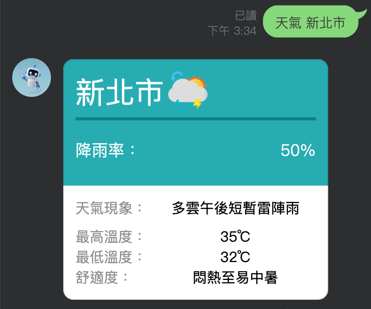
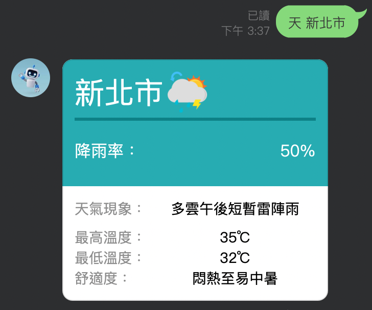
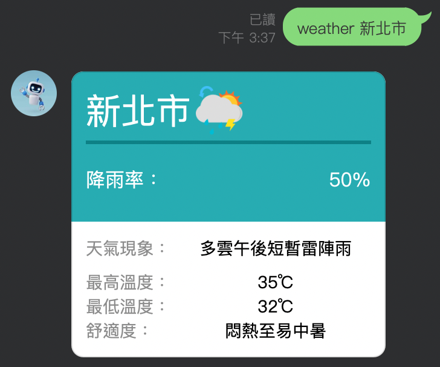

# 天氣 LineBot

這是一個基於 Line Messaging API 的天氣機器人，能夠提供台灣各縣市的即時天氣資訊。

輸入以下 ID 或掃描 QR code 即可加入 Line 好友
### ID : @885efttr

## 功能介紹

使用者可以在對話框中輸入 `天氣 縣市名稱` 、 `天 縣市名稱` 、  `weather 縣市名稱`，例如 `天氣 新北市`，即可獲得該縣市的天氣資訊，包括：
- 降雨率
- 天氣現象
- 最高溫度
- 最低溫度
- 舒適度

將「新北市」替換成其他縣市名稱即可查詢該縣市的天氣資訊。
注意 : 縣市名 "臺" 不可寫成 "台"，不可將 "臺北市" 縮寫為 "臺北"

## 使用範例
一、輸入【天氣 新北市】畫面

二、輸入【天 新北市】畫面

三、輸入【weather 新北市】畫面

四、輸入錯誤時的畫面

## 公開資料來源
氣象資料開放平台 【一般天氣預報-今明36小時天氣預報】

https://opendata.cwa.gov.tw/dataset/forecast/F-C0032-001

